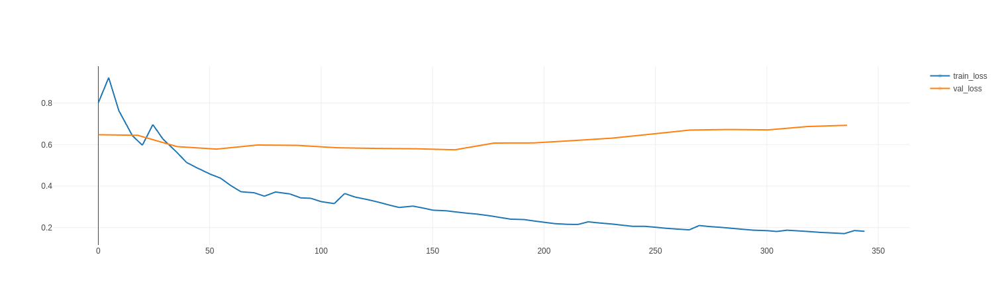
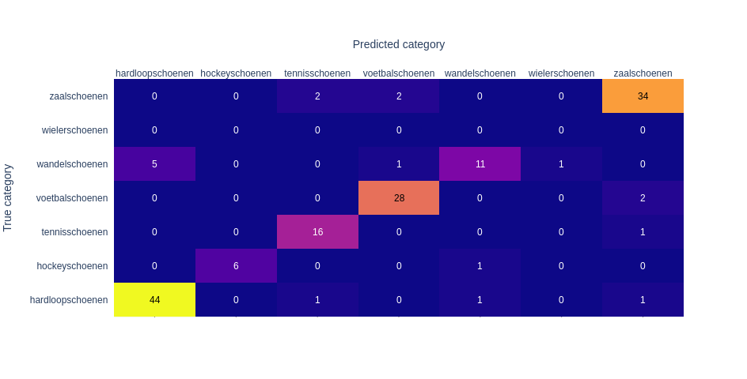
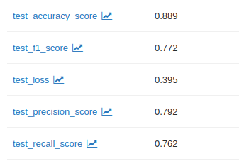
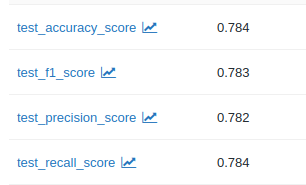
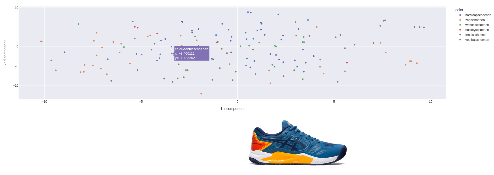

## Samenvatting
Dit project scrapet data van een webshop, om vervolgens de productcategorien van shoenen te voorspellen. Zo een voorspelling wordt gedaan op basis van de omschrijving van het product en een foto van het product. Dit is beide redelijk succesvol. Ook kunnen aan de hand van embeddings outliers gevisualizeerd worden, wat in de praktijk gebruikt kan worden om fout gelabelde producten op te sporen.

## Installatie
Dit project gebruikt [`poetry`](https://python-poetry.org/) voor dependency management. Dit staat ook toe dit project te installeren als een package. Zie de website voor details. Om de commandos uit deze readme uit te voeren moeten eerst de volgende commandos succesvol worden uitgevoerd:
```bash
poetry install
poetry shell
```

## Het verzamelen van de data
De data is verzameld van de intersport website (https://intersport.nl), dit gaat om dames- en herenschoenen uit de categorien: "hardloopschoenen", "voetbalschoenen", "wandelschoenen", "wielerschoenen", "hockeyschoenen", "tennisschoenen", "zaalschoenen".

Het scrapen wordt gedaan met behulp van [`selenium`](https://selenium-python.readthedocs.io/) en [`BeautifulSoup4`](https://www.crummy.com/software/BeautifulSoup/). Die eerste verzorgt browser-emulatie, waardoor het mogelijk is om dynamisch gegenereerde webelementen te laden, dit gaat niet met een simpele request van de `requests` library. Veel informatie staat in deze dynamische elementen.

Met `BeautifulSoup4` had ik enige ervaring, 1 of 2 keer gebuikt om een bepaald element uit een website te halen. Met selenium had ik geen eerdere ervaring.

De data kan worden verzameld door het volgende commando uit te voeren:
```bash
python scripts/extract_intersport_products.py -o data/products.parquet 
```

Dit genereert een parquet bestand met daarin product URLs, product-foto URLs, omschrijvingen, categorie, geslacht en ratings. Een ander script wordt gebruikt om de fotos te downloaden en een foto-dataset te maken.
Dit kan gedaan worden met:
```bash
python scripts/create_ml_dataset.py -i data/products.parquet -o data/product_dataset
```

Het omzetten van ruwe data in een bruikbare dataset is iets waar ik zeer bekend mee ben.


## Analyseren van de data
Er wordt een beetje data-analyse gedaan in `scripts/data_analysis.ipynb`. De data is redelijk clean. Hierin is ook de verdeling van de categorien te vinden. Data analyse heb ik ook veel gedaan, al vind ik deze data niet heel interessant om ruw te analyzeren.

## Trainen van een image model
Een model dat de categorie van de schoen voorspelt op basis van een foto kan getrained worden met het volgende commando:
```
python scripts/train_vision_model.py -d data/product_dataset
```

De resultaten, en het model zelf, worden opgeslagen met behulp van `MlFlow`, en kunnen in de browser geinspecteerd worden. Run hiervoor eerst:
```bash
mlflow ui -p 5000
```
en open dan http://localhost:5000 in je browser. Hier kunnen verschillende runs ook makkelijk vergeleken worden. Ik ben zeer bekend met de tools die ik gebruikt heb voor het trainen van het image model, hieronder vallen o.a.: PyTorch, PyTorch lightning, MlFlow en Scikit-Learn. In grote projecten gebruik ik vaak ook [`hydra`](https://hydra.cc) om efficienter experimenten uit te voeren.

De visuals voor de trainingprocedure, zoals train/validation-losses en een confusion matrix, zijn te vinden in MLFlow. Hieronder twee voorbeelden:

Train (blue) and validation (orange) loss         |  Confusion matrix
:-------------------------:|:-------------------------:
      |  

Hieronder de test-metrics:



## Trainen van een text model
Een model dat de categorie van de schoen voorspelt op basis van de omschrijving kan getrained worden met het volgende commando:
```
python scripts/train_text_model.py -d data/products.parquet
```
Dit traint een 'simpel' classificatie model op embeddings gegenereerd door een large language model, van de [`SentenceTransformers`](https://www.sbert.net/) library.

Ook hier zijn de resultaten weer te vinden in MlFlow.
Met de `SentenceTransformers` library heb ik 1 keer eerder gewerkt.

Hieronder een typische confusion matrix voor een text model:


En hier voorbeeld test-metrics:




## Embedding en outlier analyse
Door een gereduceerde representatie van de embeddings van een model te inspecteren kunnen we zoeken naar outliers en naar samples die moeilijk zijn voor het model. Dit kan makkelijk gedaan worden met behulp van een tool die ik eerder een keertje heb ontwikkeld. Dit is voor nu alleen gedaan voor het image model, omdat deze gefinetuned wordt op de data. Run hiervoor:
```bash
python scripts/run_embedding_visualization_app.py -d data/product_dataset -v de034182f9194041b65d7905a4329f66
```
Het argument van `-v` moet vervangen worden door een run id van een getraind model in MLFlow. De resultaten voor de visualizatie zijn niet zo goed als gehoopt. In eerdere projecten waren er veel duidelijkere clusters. Hier en voorbeeld:


Deze visualizaties heb ik dus al ervaring mee.


## Prediction service
In plaats van een REST API heb ik er voor gekozen om een GRPC server te implementeren, aangezien dit meerdere voordelen heeft. Zo is grpc o.a. efficienter en minder foutgevoelig. Het protocol gaat over http en kan dus eigenlijk altijd gebruikt worden ipv REST.

De server biedt de mogelijkheid om een voorspelling te doen op basis van een foto of een productomschrijving.

De server kan gestart worden met:
```bash
python scripts/run_category_prediction_server.py -t 50e58a2e11f1443cbea3479de051a7c3 -v de034182f9194041b65d7905a4329f66 -d data/products.parquet
```
Waar het argument na `-t` de run id is van een getrained textmodel, en het argument na `-v` de run id van een getraind vision model.

Een voorbeeld client kan gevonden worden in `scripts/test_category_prediction_server.py`, deze haalt resultaten op voor fotos en omschrijvingen via de server. De resultaten laten zien dat de implementatie goed werkt, aangezien de performance die behaalt wordt in deze test naar verwachting is. De test kan gerund worden met:
```bash
python scripts/test_category_prediction_server.py --data-file data/products.parquet --dataset-dir data/product_dataset
```

Hier example output van dit laatste script (omdat de training data er ook bij zit zijn de metrics vrij hoog):
```
2023-10-13 02:56:12.865 | INFO     | __main__:main:67 - text metrics:
Metrics(f1_score=0.8141976210885021, accuracy_score=0.8119795563555826, precision_score=0.8176828423677164, recall_score=0.8119795563555826, confusion_matrix=array([[424,   0,   0,   0,  10,   0,   1],
       [  0,  62,   0,   2,   0,   0,   0],
       [  0,   1, 143,   0,   0,   0,   0],
       [  0,   0,   0, 271,   0,   0,   2],
       [ 28,   0,   0,   0, 131,   0,   3],
       [  3,   0,   0,   0,   1,   0,   1],
       [  0,   1,   1,  15,   2,   0, 333]]))
2023-10-13 02:56:12.870 | INFO     | __main__:main:67 - image metrics:
Metrics(f1_score=0.8946207112452075, accuracy_score=0.9171611046035554, precision_score=0.8780630933732503, recall_score=0.9171611046035554, confusion_matrix=array([[432,   0,  11,   1,  22,   0,   2],
       [  0,  67,   0,   1,   1,   0,   0],
       [  0,   0, 159,   1,   0,   0,   9],
       [  0,   1,   1, 296,   0,   0,   5],
       [ 16,   0,   0,   3, 153,   3,   1],
       [  0,   0,   0,   0,   1,   4,   0],
       [  0,   1,  10,  12,   0,   0, 354]]))

```

Ik heb in python nooit eerder GRPC geimplementeerd, wel ooit een grpc client gemaaakt. Ook heb ik geen ervaring met het maken van REST APIs, wel heb ik eens een keer een webserver gemaakt.

## Extra opmerkingen
- Ondanks dat het een relatief klein onderdeel lijkt, heeft het scrapen veel tijd gekost. Dit omdat het gedrag van websites niet heel goed te voorspellen is.
- Ik ben hier ongeveer 12 uur mee bezig geweest (waarvan 5 uur scrapen)